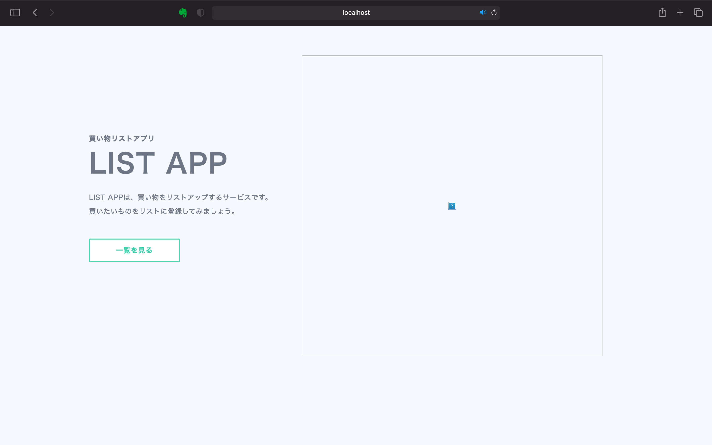
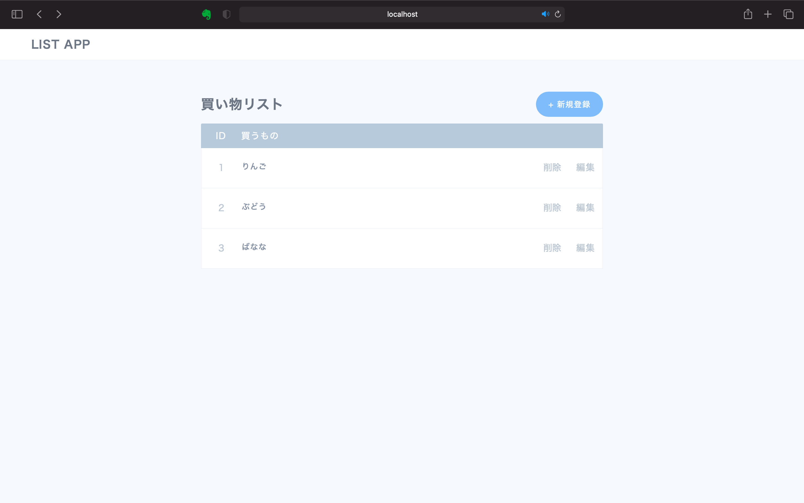
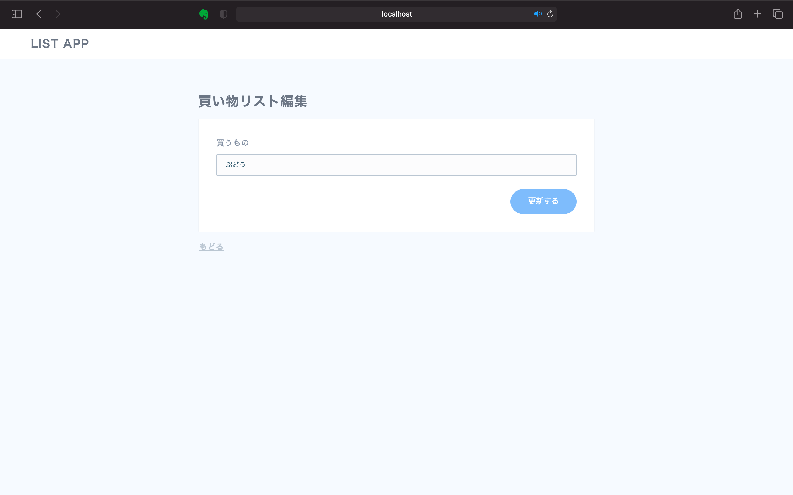

# 買い物リストアプリ
買い物リストの追加、編集、削除ができるwebアプリ。   
データベースにMySQLを使用。
`feature/local`ブランチのものをdockerコンテナ化した。

## アプリの起動方法
`docker-compose.yml`と`app/mysqlConnection.js`にmysqlのユーザー名、パスワードを記載。
```
docker compose build
docker compose up -d
```
`localhost:3000` にアクセス   
※ localhost:3000/indexにアクセスした際、index.ejsでエラーが出る場合、ページをリロードするか、時間を置いてからアクセスするとなぜか動くようになります（謎）

## アプリの終了
```
docker compose down
```

## 完成品
localhost:3000/

localhost:3000/index

localhost:3000/new

localhost:3000/edit

