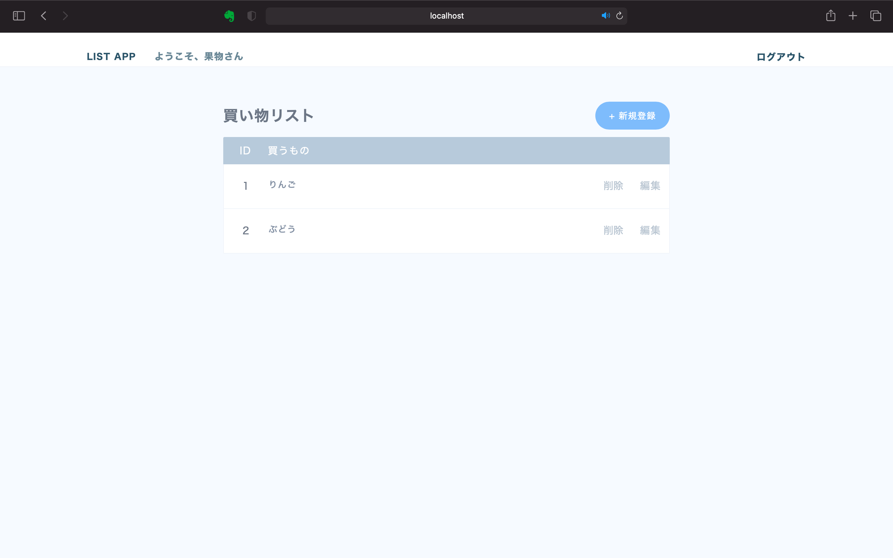

# 買い物リストアプリ
買い物リストの追加、編集、削除ができるwebアプリ。   
データベースにMySQLを使用。
`feature/local`ブランチのものをdockerコンテナ化した。

## アプリの起動方法
```
docker compose build
docker compose up -d
```
`localhost:3000` にアクセス

## アプリの終了
```
docker compose down
```

## 完成品
localhost:3000/

localhost:3000/index

localhost:3000/new

localhost:3000/edit
