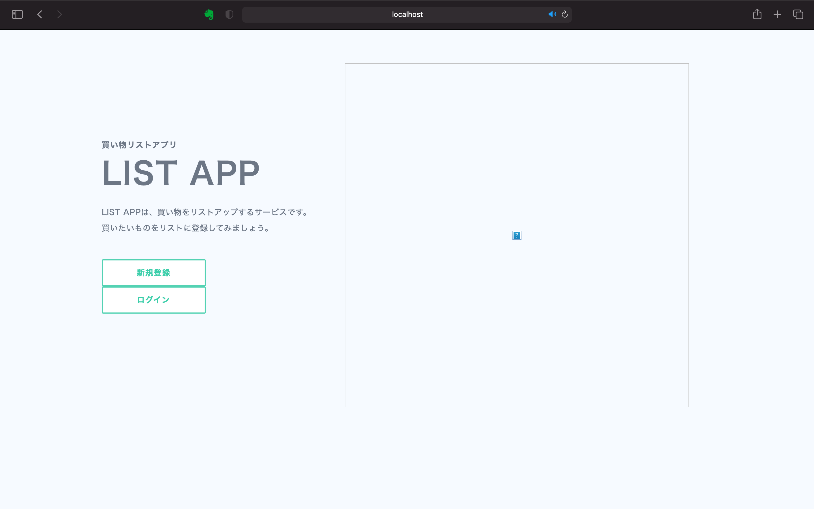

# 買い物リストアプリ
買い物リストの追加、編集、削除ができるwebアプリ。   
データベースにMySQLを使用。
`feature/docker`ブランチのものを元に、会員登録機能・登録者ごとのリスト表示機能を追加。

## アプリの起動方法
```
docker compose build
docker compose up -d
```
`localhost:3000` にアクセス   
※ localhost:3000/indexにアクセスした際、index.ejsでエラーが出る場合、ページをリロードするか、時間を置いてからアクセスすると動くようになる（謎）

## アプリの終了
```
docker compose down
```

## 完成品
localhost:3000/

localhost:3000/login

localhost:3000/signup

localhost:3000/index/:userId

localhost:3000/new

localhost:3000/edit
